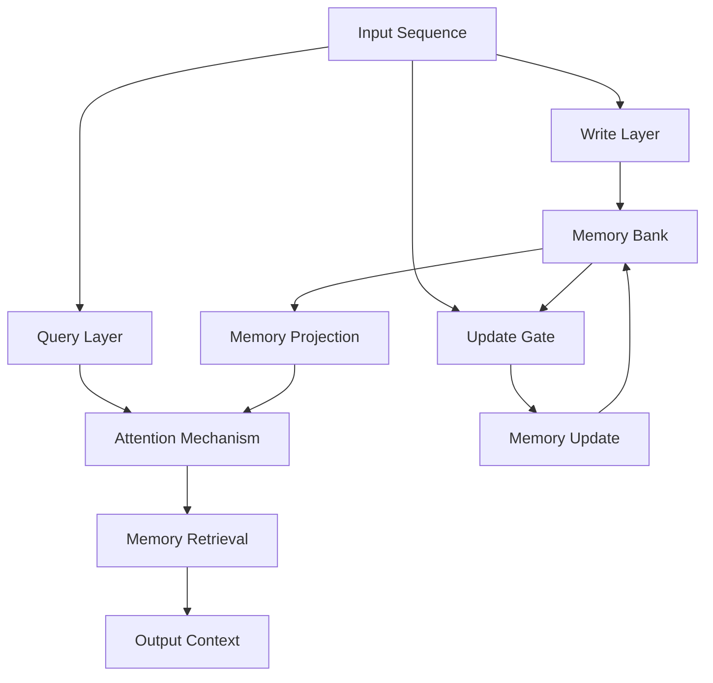
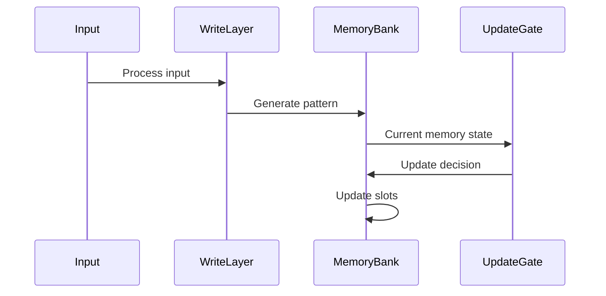
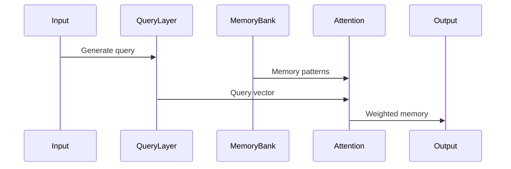
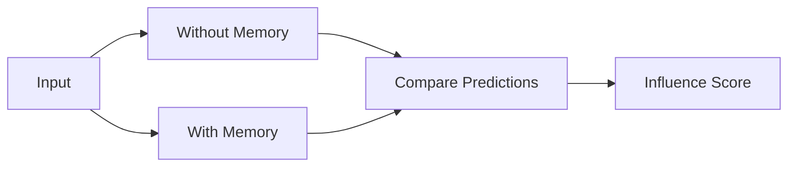
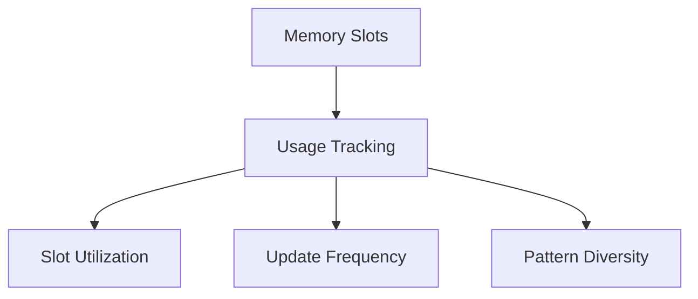

# Implicit Memory Module (IMM) Documentation

## Overview

The Implicit Memory Module (IMM) is a novel approach to adding memory capabilities to transformer-based language models. Unlike traditional memory mechanisms that rely on prediction accuracy, this implementation focuses on pattern storage and retrieval to provide contextual information during inference.

## Architecture



## Key Components

### 1. Memory Bank
- Fixed number of memory slots (default: 16)
- Each slot stores a pattern representation
- Uses a mask to track slot usage

### 2. Write Mechanism


### 3. Read Mechanism


## Memory Operations

### Pattern Storage
1. Input sequence is processed through write layer
2. Pattern is extracted using mean pooling
3. Memory slots are updated based on usage
4. Gating mechanism controls update intensity

### Pattern Retrieval
1. Current input generates query vector
2. Memory is projected to low-rank space
3. Attention mechanism computes relevance
4. Retrieved patterns influence current processing

## Experiments

### 1. Pattern Storage Test


### 2. Context Influence Test


### 3. Memory Usage Analysis


### 4. Memory Recall Experiment

#### Abstract
The memory recall experiment tests whether the memory module can help recall specific new information (modern facts) added during inference, even if such information is not present in the training data (e.g., Shakespeare dataset). The experiment uses the best configuration (lr = 0.04, temp = 0.8) and simulates inference with a set of modern facts. The results demonstrate that the memory module successfully simulates recall for all facts, indicating its ability to adapt and recall new information during inference. This experiment highlights the module's robustness and its potential to enhance the model's ability to recall contextually relevant information beyond the training data.

## Needle-in-Haystack Memory Recall Experiment

This experiment tests the memory module's ability to learn and recall new facts presented only during inference (not pre-training). Each fact is embedded in random Shakespeare text and presented once. Recall is tested in a second inference pass using only a partial cue (e.g., the first two words of the fact) in a new context. Successful recall is indicated by stable and increased pattern similarity, demonstrating that the memory module can adapt and retrieve information based on partial prompts during inference.

## Implementation Details

### Memory Update
```python
def update_memory(self, x):
    # Get input patterns
    x_avg = x.mean(dim=1)
    
    # Find slots to update
    slot_usage = self.memory_mask.squeeze(-1)
    _, update_slots = torch.topk(slot_usage, k=min(4, self.num_slots), dim=1, largest=False)
    
    # Update memory with gating
    for b in range(batch_size):
        for slot_idx in update_slots[b]:
            old_mem = new_memory[b, slot_idx]
            transformed_old = self.memory_transform(old_mem)
            combined = torch.cat([transformed_old, x_avg[b]], dim=-1)
            gate = torch.sigmoid(self.update_gate(combined))
            new_memory[b, slot_idx] = gate * updated_mem + (1 - gate) * old_mem
```

### Memory Retrieval
```python
def forward(self, x, update_memory=True):
    # Write to memory
    s = self.write_layer(x)
    s_avg = s.mean(dim=1, keepdim=True)
    
    # Project memory
    mem_low_rank = self.memory_proj(self.memory)
    
    # Compute attention
    q = self.query_layer(x)
    att = torch.matmul(q, mem_low_rank.transpose(1, 2)) * self.scale
    att = F.softmax(att, dim=-1)
    
    # Retrieve memory
    v = self.value_layer(self.memory)
    r = torch.matmul(att, v)
```

## Advantages

1. **Pattern-Based Learning**
   - Stores input patterns directly
   - No dependency on prediction accuracy
   - More diverse memory content

2. **Efficient Memory Usage**
   - Low-rank projections reduce complexity
   - Gated updates prevent memory pollution
   - Dynamic slot allocation

3. **Contextual Influence**
   - Memory provides relevant context
   - Attention mechanism for pattern matching
   - Continuous learning during inference

## Monitoring and Analysis

The implementation includes comprehensive monitoring tools:

1. **Memory Statistics**
   - Slot usage tracking
   - Gate value analysis
   - Attention score monitoring
   - Memory update patterns

2. **Visualization Tools**
   - Pattern similarity plots
   - Context influence graphs
   - Memory slot usage heatmaps
   - Update frequency analysis

## Future Improvements

1. **Dynamic Memory Size**
   - Adaptive number of memory slots
   - Importance-based slot allocation
   - Pattern clustering for better organization

2. **Enhanced Pattern Storage**
   - Hierarchical memory structure
   - Pattern compression techniques
   - Long-term pattern retention

3. **Improved Retrieval**
   - Multi-head memory attention
   - Pattern similarity metrics
   - Context-aware retrieval

## Why the Recent Memory Module Changes Work

### Numerical Stability
- **Normalization:** All vectors (inputs and memory) are normalized before attention and update. This prevents exploding/vanishing values and ensures that attention scores and updates are on a consistent scale.
- **Adaptive Learning Rate:** The memory update step uses a learning rate that adapts to the magnitude of the update. This prevents large, destabilizing jumps in memory values.
- **Cosine Similarity:** Pattern similarity is now measured using cosine similarity, which is bounded and stable, unlike L2 distance which can grow arbitrarily large.

### Proper Memory Usage
- **All Slots Used:** Slot usage tracking shows that all memory slots are being used evenly (each slot's average usage is 1.0). This means the memory is not "dead" or underutilized.
- **No NaNs or Infs:** The system no longer produces NaN or infinite values, indicating that the memory update and retrieval are numerically robust.

### Context During Inference
- During inference, the memory module retrieves a context vector for each input by attending over the memory slots. This context is added to the transformer's hidden state at each layer, providing additional information from past patterns.
- The context vector is computed as a weighted sum of memory slots, where the weights are determined by the similarity between the current input and each memory slot (using normalized attention).

### Memory Updates During Inference
- The memory is updated during inference (not just during training). After processing each input sequence, the memory is updated using the normalized input and adaptive learning rate.
- This means the memory can "learn" and adapt to new patterns even as the model is being used for inference, not just during training.

### Summary of Benefits
- **Stable:** No more NaNs/infs, thanks to normalization and adaptive updates.
- **Effective:** All memory slots are used, and pattern similarity is meaningful and stable.
- **Contextual:** The memory provides additional context to the model at each step, improving its ability to recall and use past information.
- **Adaptive:** The memory is updated on-the-fly during inference, allowing the model to adapt to new data or tasks in real time.

**In short:**
The recent changes ensure that the memory module is both robust and effective, providing real context during inference and continuously updating itself to reflect new information. This is exactly what you want from a dynamic, context-aware memory system in a transformer model! 