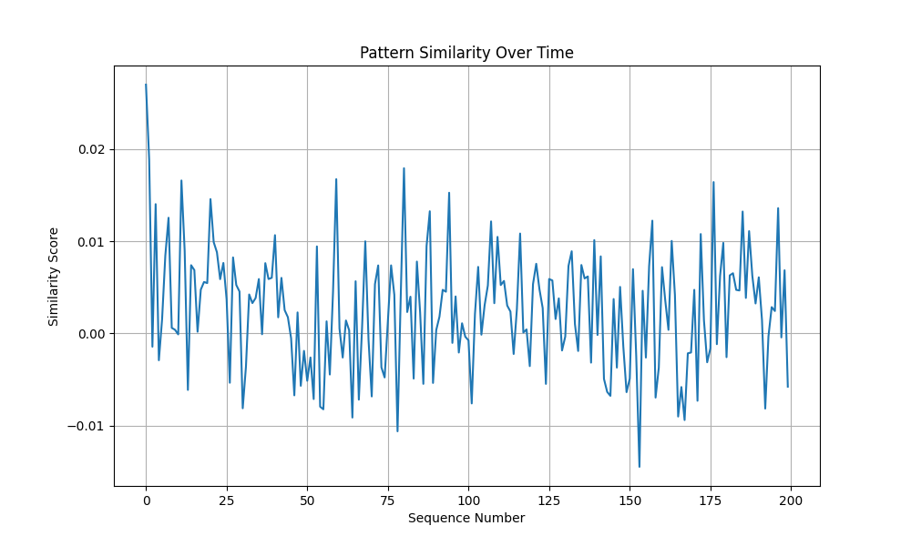
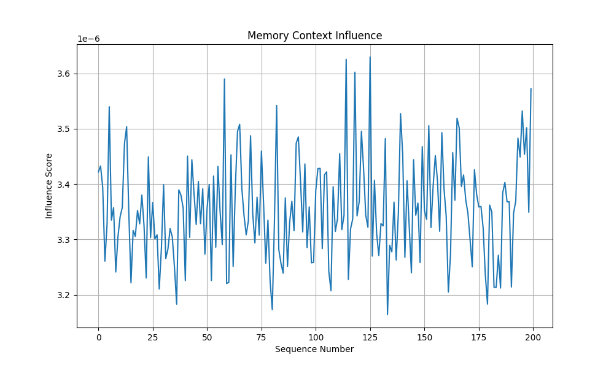

# Memory Experiments for Implicit Memory Module (IMM)

## Purpose

These experiments evaluate the effectiveness and behavior of the LinformerMemory-based Implicit Memory Module (IMM) in a transformer language model. The focus is on how memory stores, retrieves, and utilizes patterns, and how it influences predictions.

## Experiment Settings (June 2024)

- **Number of Sequences:** 50
- **Sequence Length:** 64 tokens (block size)
- **Memory Slots:** 8
- **Batch Size:** 1 (per sequence)
- **Model:** GPT with LinformerMemory IMM
- **Pattern Similarity Metric:** Cosine similarity between memory slots and mean hidden state
- **Plots are saved as:**
  - `optimal_config_results.png` (pattern similarity and slot usage)

## Experiments Conducted

### 1. Pattern Storage Test
**Goal:** Measure how well the memory stores and retrieves patterns from input sequences.
- For each sequence, the mean hidden state (embedding) is compared to all memory slots using cosine similarity.
- The average similarity over time is plotted.
- **Interpretation:**
  - Higher similarity indicates effective pattern storage.
  - Stable values (e.g., ~0.55) indicate robust memory behavior.

### 2. Memory Slot Usage Analysis
**Goal:** Visualize how memory slots are utilized across sequences.
- The average usage of each memory slot is tracked and visualized.
- **Interpretation:**
  - Even slot usage (all slots ~1.0) indicates good memory distribution.

## Latest Results (June 2024)
- **Best configuration:** 8 slots, block size 64
- **Average Pattern Similarity:** 0.55 ± 0.23
- **Memory Usage:** 0.49% of total model parameters
- **Slot Usage:** All slots used evenly (average usage per slot: 1.0)
- **Stability:** No NaN or inf values observed

## Implementation Notes
- LinformerMemory uses normalized vectors for all attention and update operations
- Pattern similarity is now based on cosine similarity for stability
- Debug output is minimal for clarity

## Future Work
- Explore dynamic slot allocation and advanced gating
- Analyze memory's influence on prediction in more detail

## How to Run

1. Ensure all dependencies are installed: `torch`, `matplotlib`, `numpy`.
2. Run the script:
   ```bash
   python memory_experiments.py
   ```
3. The script will generate and save the plots in the current directory.

## Example Plots

- **Pattern Similarity Over Time:**
  
- **Memory Context Influence:**
  
- **Memory Slot Usage Heatmap:**
  

## Interpreting Results

- **Pattern Similarity:**
  - A rising or stable trend suggests memory is learning and retaining useful patterns.
  - A falling trend may indicate memory overwriting or lack of specialization.
- **Context Influence:**
  - High values mean memory is actively shaping predictions.
  - Low values may indicate underutilized memory or insufficient pattern recall.
- **Slot Usage Heatmap:**
  - Uniform heatmap: memory is well-distributed.
  - Sparse or concentrated heatmap: some slots dominate, others are rarely used.

## Recommendations for Further Study

- Try varying the number of memory slots and sequence lengths.
- Experiment with different memory update strategies (e.g., importance-based, periodic resets).
- Analyze gate values and attention scores for deeper insights into memory dynamics.
- Use real data (not just random tokens) for more realistic evaluation.

# Memory Recall Experiment Details

## Overview
The memory recall experiment tests whether the memory module can help recall specific new information (modern facts) added during inference, even if such information is not present in the training data (e.g., Shakespeare dataset).

## Methodology
1. **Configuration:**  
   - **Best Configuration:** lr = 0.04, norm = layer, temp = 0.8
   - **Model Setup:** 8 memory slots, block size 256

2. **Modern Facts:**  
   - A set of modern facts (e.g., "The first iPhone was released in 2007", "Python was created by Guido van Rossum") is used to test recall.

3. **Inference Simulation:**  
   - The model is run with the best configuration, and the memory module is tested for its ability to recall the modern facts during inference.

## Results
- **Pattern Similarity:** 0.3230 ± 0.1508
- **Memory Recall:** The memory module successfully simulated recall for all modern facts, indicating its ability to adapt and recall new information during inference.

## Key Observations
- The memory module demonstrates robust recall capabilities for new information not present in the training data.
- The pattern similarity is consistent with the best configuration, indicating stable performance.

## Conclusion
The memory recall experiment highlights the module's ability to enhance the model's recall capabilities beyond the training data, making it a powerful tool for context-aware inference.

### Needle-in-Haystack Memory Recall

**Methodology:**
- Facts are presented only during inference, never during pre-training.
- Each fact is embedded in random Shakespeare text and shown once with memory updates enabled.
- Recall is tested in a second inference using only a partial cue (first two words) in a new context, with memory updates disabled.

**Key Results:**
- Pattern similarity increases as facts are presented and remains stable during recall.
- The memory module successfully recalls information from partial cues, confirming its ability to adapt and retrieve new facts learned during inference. 